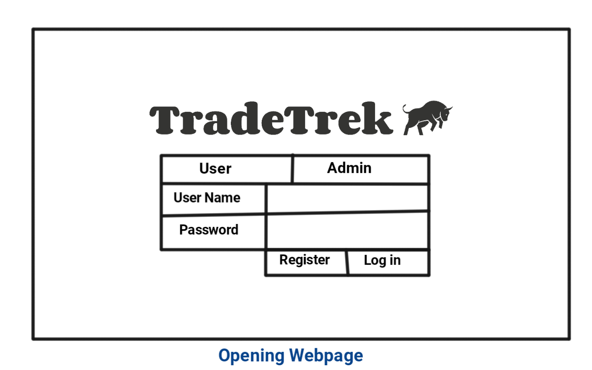
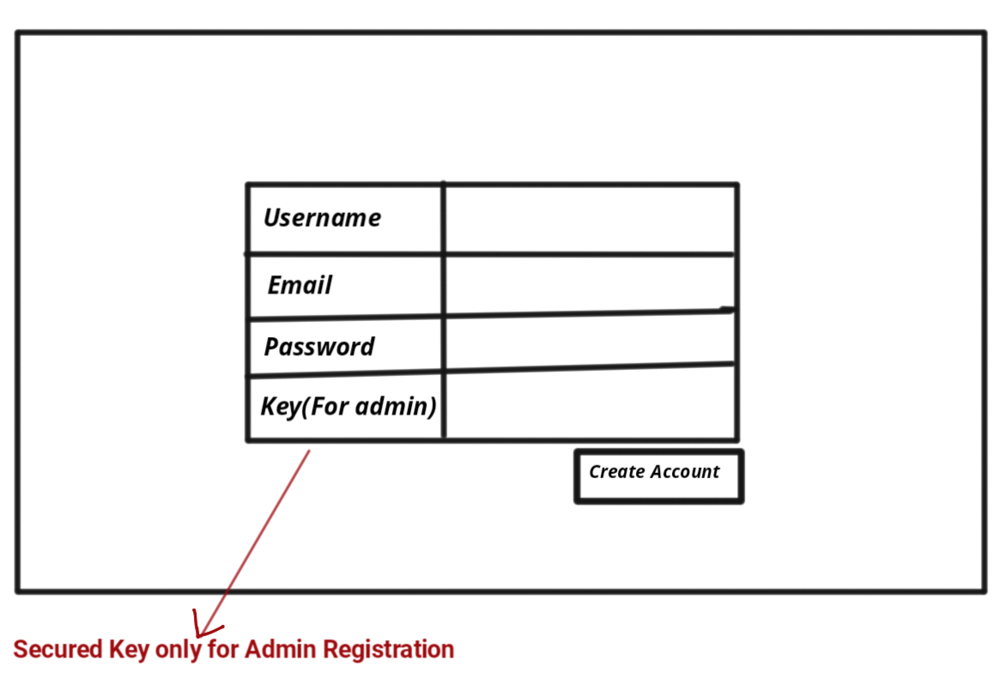
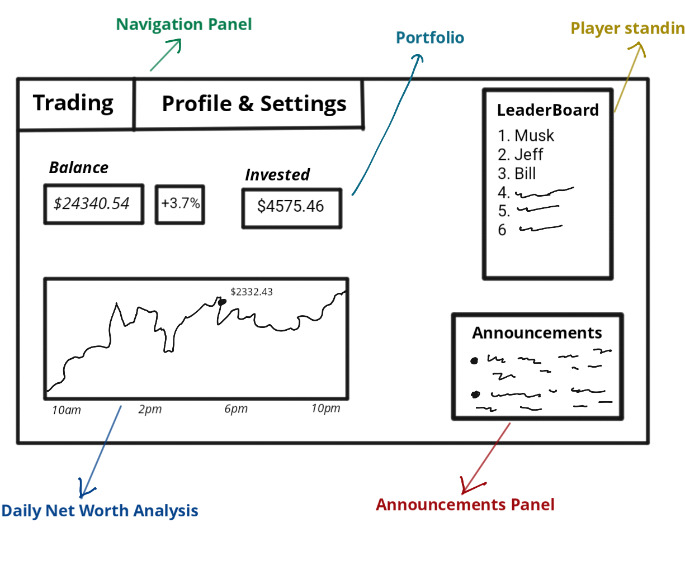
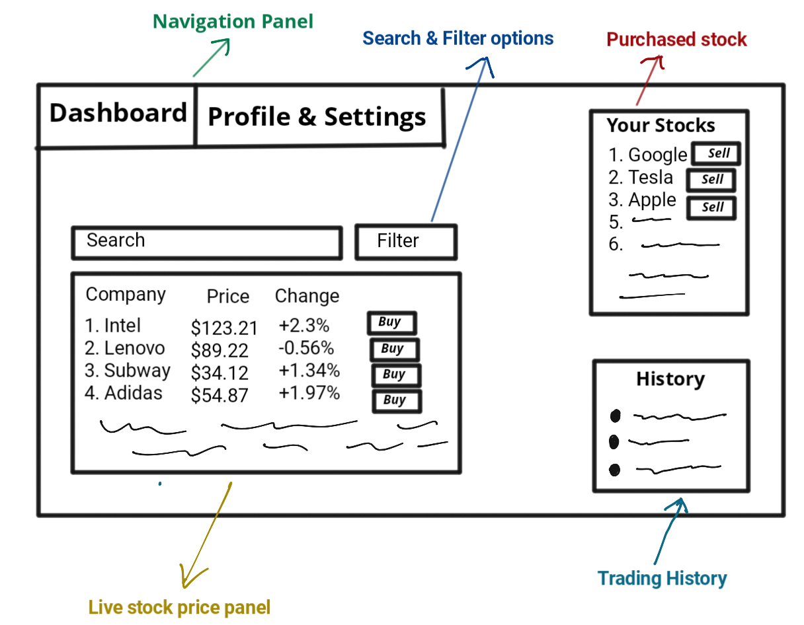
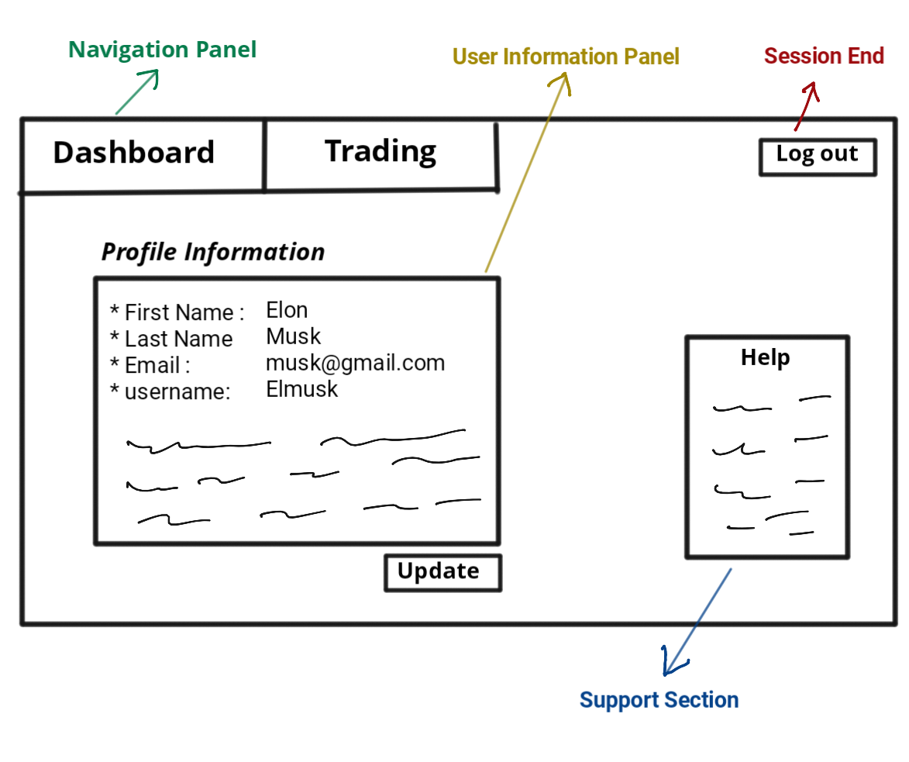
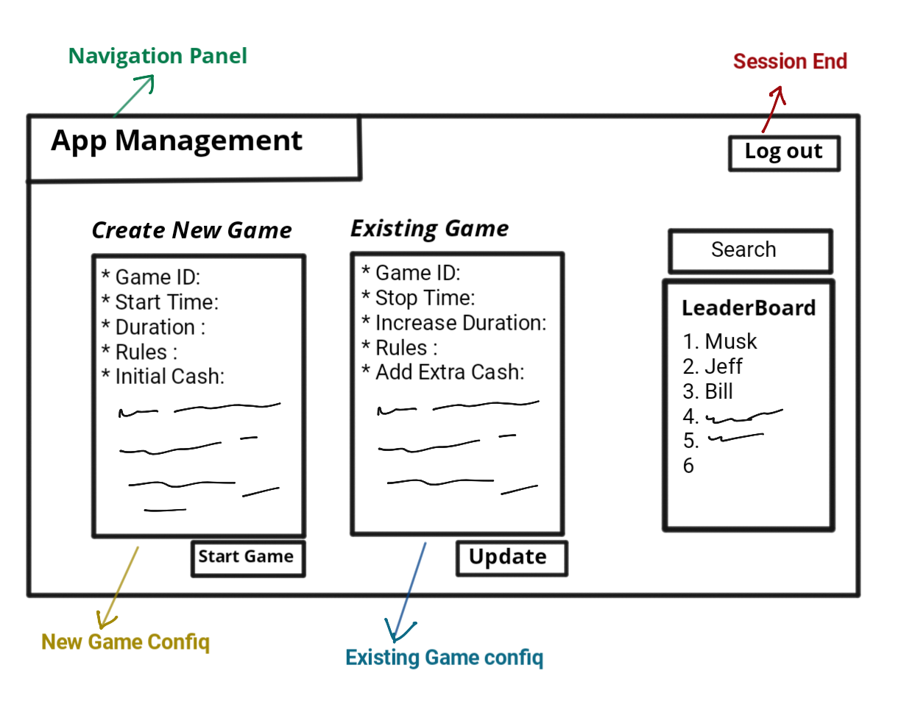
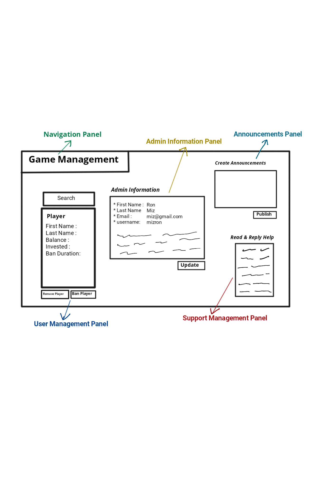

# TradeTrek

## Description
In this course, I will build "TradeTrek," a web-based stock trading simulation game. "TradeTrek" will be designed to mirror the fast-paced and strategic environment of the stock market. Participants in the game will assume the roles of traders, each beginning with an initial amount of virtual cash. The objective is simple: engage in buying and selling stocks, as one would in the real NYSE, to maximize the portfolio's value and outperform fellow traders by the end of the competition.

As a player in "TradeTrek," you will navigate through a user-friendly interface that brings the stock market to your fingertips. You will strategize to grow your initial cash through calculated investments, all the while adapting to the real-time fluctuations of stock prices provided by the Alpha Vantage API. The excitement of the game comes not only from trading but also from trying to climb up the ranks to be at the top of the leaderboard.

From the administrator's perspective, "TradeTrek" offers a control center to maintain the game's flow. Admins can initiate new games, set and adjust game durations, manage user registrations, and decide transaction fees. The admin dashboard provides a comprehensive view of all player activities, enabling the execution of fair play and the ability to declare a conclusive winner.

The construction of "TradeTrek" will utilize a suite of modern development tools. The backend functionality will be powered by Express.js, with MongoDB via Mongoose for database management, ensuring robust and scalable game operations. The user interface will be produced with Bootstrap for a sleek, responsive design. Tools like Postman will assist in testing APIs, while Prettier will ensure clean code, and Live Server will allow for real-time updates during development.

In the end, "TradeTrek" is not just a game. It's a way to experience trading stocks online that teaches you, lets you plan strategies, and is fun, all in a game that feels like the real stock market.

## Screens 

### Initial Page

### Registration webpage

### Players Interface

#### Dashboard

#### Trading

#### Profile Information

 
### Admins Interface

#### Game Management

#### App Mangement
  

 
 

## Features
|ID|Name|Access By|Short Description|Expected Implementation|Source of Idea|
|--|----|---------|-----------------|-----------------------|--------------|
|01|Player Registration|Player|Players register for a specific game.|Must implement|Project instructions|
|02|Session Management|Admin|Maintain player login and profile information.|Must implement|Project instructions|
|03|User and Admin Info|Both|Both admins and players will have a user info page and can update it.|Must implement|Seen in other games|
|04|Initial Cash|Admin|Provide all players with a starting cash account in their portfolio.|Must implement|Project instructions|
|05|Live Stock Price|Both|View the live price of the stocks.|Must implement|Project instructions|
|06|Buy and Sell Stock|Player|Allow players to buy and sell actions at the current NYSE prices.|Must implement|Project instructions|
|07|Tracking Portfolio and Its Value|Both|Keep track of each player's portfolio and its value.|Must implement|Project instructions|
|08|Game Duration|Admin|Configure the start and end of each game individually.|Likely to be done|Lots of other games I know|
|09|Create Games|Admin|Admin can create games and its configurations.|Must implement|Project instructions|
|10|Transactions Fee|Admin| Admin can set fees for buy/sell transactions.|Must implement|Project instructions|
|11|Tracking Activities|Admin|Tracking all trades and activities of a player during the game.|Must implement|Project instructions|
|12|Game Configuration|Admin|Configure game time and starting amount.|Must implement|Project instructions|
|13|Declare a Winner|Admin|Declare a winner at the end of the game.|Must implement|Project instructions|
|14|Increase Game Time|Admin|Admin can increase the game time.|Likely to be done|Classmate|
|15|Immediate Stop Game|Admin|Admin can stop the game at any time if needed.|Likely to be done|Seen in other games|
|16|Stock Selection|Admin|Admin can decide which stocks to show.|Likely to be done|Seen in other games|
|17|Ban or Remove Player|Admin|Admin can ban or remove a player if the player violates any rule.|Probably not unless it's easy|Seen in other games|
|18|News Panel|Both|Admins can post financial and stock-related news to the panel for players to read|Probably not unless it's easy|Seen in other games|
|19|Announcement Board|Both|Players can see announcements, and admins can post them.|Must implement|Seen in other games|
|20|Help Section|Both|Players can contact the admins if they face any technical difficulties.|Likely to be done|Seen in other games|
|21|Chat Channel|Both|Players can talk to each other on the channel.|Probably not unless it's easy|Seen in other games|
|22|Social Media Integration|Both|Players can share their achievements or activities on social media.|Likely to be done|Social media features in apps|
|23|Report a Player|Both|Players can report others for cheating or using abusive language on the chat channel, and admins will address the issue|Likely to be done|Seen in other games|
|24|Moving Average|Player|An added feature to candlestick charts.|Probably not unless it's easy|Websites like Investopedia|
|25|Leadership Board|Both|Able to see the leadership board to know other player positions.|Likely to be done|Seen in other games|
|26|Badge|Player|One player will get a badge after gaining experience and completing specific tasks.|Probably not unless it's easy|Seen in other games|
|27|Learning Section|Both|Admins can post educational content on stock trading, allowing players to learn and enhance their trading skills.|Probably not unless it's easy|Seen in other games|
|28|Crypto Trading|Player|Players can also trade different cryptos and coins at live prices.|Probably not unless it's easy|Seen in other games|
|29|Multiple Game Modes|Admin|Admins can create different game modes with varied rules.|Likely to be done|Seen in other games|
|30|In-Game Challenges|Player|Admins can set challenges for players to complete during the game to get bonus points.|Likely to be done|Seen in other games|

#### Session Management (02)
Session management is really important for the game as it will ensure that every player's and admin's information and data are secured. It will maintain the security and make sure only admins can access the features designed for them, which ensures the fairness of the game.

#### Ban or Remove Player (17)
The ability to Ban or Remove a Player is a critical administrative function in "TradeTrek" that allows admins to uphold the game's standards by removing or banning players who break the rules. This feature plays a key role in safeguarding the game's integrity and fairness, ensuring that all participants follow the rules

## Tools and packages
 - Express.js
 - MongoDB (with Mongoose):
 - Bootstrap
 - Postman
 - Prettier
 - Live Server

 ## App API
 1. POST /users/register
 - Endpoint for player or admin registration.
 2. POST /users/login
 - Endpoint for user login, to authenticate and create a session.
 3. GET / games/:gameId/leaderboard
 - Retrieves the leaderboard of a specific game using  game ID.
 4. POST /trades/buy
 - Processes a stock purchase for a player.
 5. POST /trades/sell
 - Processes a stock sale for a player.
 6. PUT /users/:userId/profile
 - Endpoint to update user profile information.
7. GET /stocks/prices
- Provides live stock prices.

8. POST /game/create
- Creates a new game with specific configurations set by an admin.

## Stock API
After research I selected to use Alpha Vantage for my project,I will use Alpha Vantage because it provides easy and free access to real-time and historical stock data. 
My API call link is provided bellow
GET https://www.alphavantage.co/query?function=TIME_SERIES_INTRADAY&symbol=IBM&interval=5min&apikey=[ILMGTNFVOI39WQC5]

## Attributions
| Source                                   | Contribution                                      | Location      |
|------------------------------------------|---------------------------------------------------|---------------|
| Project Description from Project folder  | Provided the project concept and some features (Prof Ed.Brown)   | `proposal.md` |
| My classmate Ahmed Julkarnayem           | Exchanged ideas about features                    | `proposal.md` |
| My classmate Sahariar Nirjon             | Discussed API details                             | `proposal.md` |
